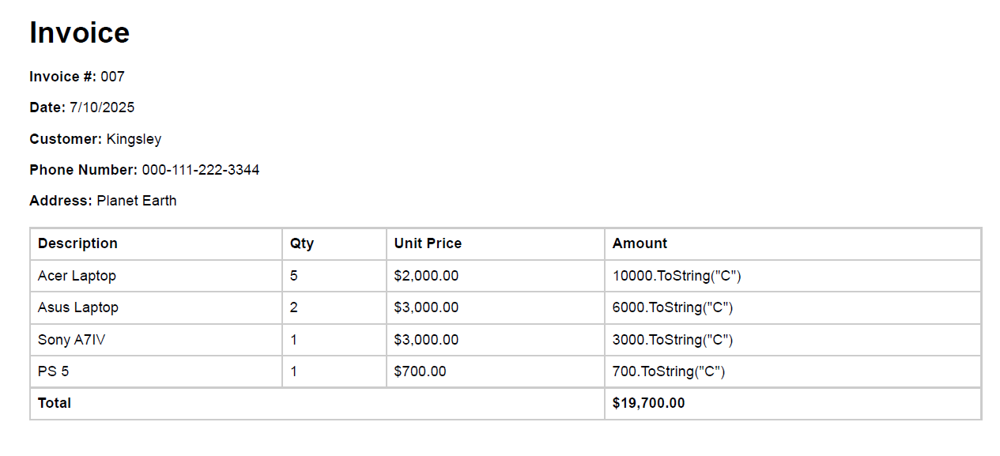

## Introduction
A PDF Generator. Converts html templates to pdf.

It Generates the html by setting up a headless browser

## Sample

## Setup
If you are running the application for first you would need install Browsers.
To do this you just need to uncomment this line in the Program.cs file 

`Microsoft.Playwright.Program.Main(["install"]);`
